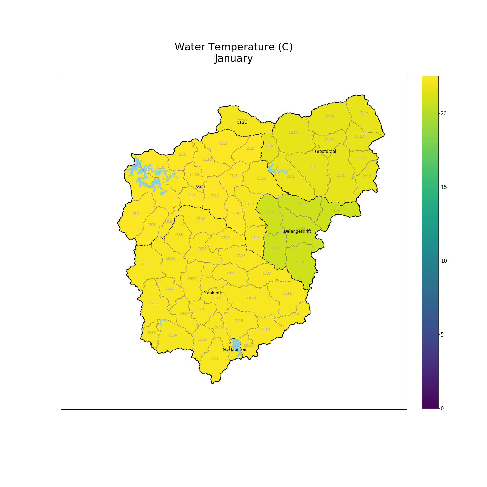
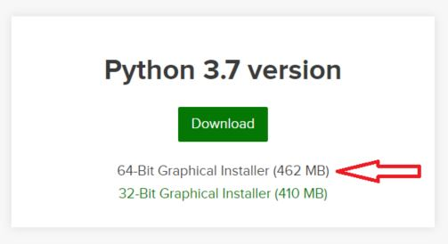
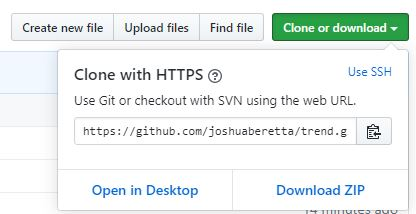

# Trend
> Generating animations from GIS and node data

This program generates animated gifs for a yearly and monthly period for each variable of interest. The output of the programme consists of:
 - Images for each year in the variable series in .png format
 - Images for each month in the variable series in .png format
 - Animations for the years and months for each variable in .gif format

The input vaiables as well as some other minor tweaks can be configured in the `config.yaml` file.

Here's an example animation output:



## Installation

>(Note:
All the following lines in this file that
```sh
look like this
```
>must be copy and pasted into your `Anaconda Prompt`, followed by pressing `enter` on your keyboard.)

### First and foremost
If you don't already have `Anaconda` installed, go to the this [website](https://www.anaconda.com/distribution/) and download the following file for your particular operating system (Windows / macOS / Linux):



Once the download has completed, follow the instructions in this [article](https://problemsolvingwithpython.com/01-Orientation/01.03-Installing-Anaconda-on-Windows/) for installing `Anaconda` on your system.

### Getting the files
> Note: The `geo_db.gdb` file was too large to store in Github - it's not designed for large file storage. I'll have to send it separately.



Here you have a two options:

1. Click `Download ZIP` and wait for the download to finish.
    - Unzip the file in your desired location and continue with the setup process

2. Copy the link in the box: `https://github.com/joshuaberetta/trend.git`
    - In the `Anaconda Prompt`, navigate to the desired location, i.e. type:
```sh
cd <my-desired-location>
```

Once you are located there in your terminal, run the following command and wait for the download to complete:

```sh
git clone https://github.com/joshuaberetta/trend.git
```

Finally, move into the directory you have just downloaded / cloned:
```sh
cd trend
```

## Environment setup
> Ensure you are located in the `trend` folder in your `Anaconda Prompt`


> Only do the following environment installation once

Run the following command in your `Anaconda Prompt`:
```sh
conda env create -f environment.yml
```

Wait for all the downloads to take place. If prompted to type `[y/n]`, type: 
```sh
y
```

> Do this after installing the envrionment files and each time you return to run the programme in the future

Run the following command to activate your environment:
```sh
conda activate trend
```
> The beggining of your command line should now say `(trend)`, indicating that the `trend` environment is active

Once you have completed running the program and you have all your outputs, run the following command:
```sh
conda deactivate
```

## Usage example

Open the `config.yaml` file in your text editor of choice and follow the instructions in the file. 
> If you don't have a text editor, download any of the following free programmes: `VS Code`, `Sublime`, `Notepad++`, etc.

Run the following command from the directory where `cli.py` is placed:
```sh
python cli.py
```

### Notes

> The program should now be running and there should be a progress bar moving along.
> The outputs of the script will now be sitting in the output folder specified in the `config.yaml` file, ex. `outputs`

## Meta

If you have any issues with any of these steps, please contact me to assist.